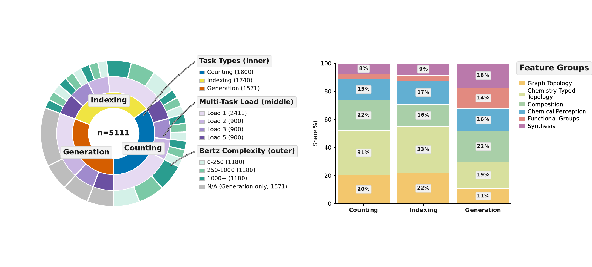

<div align="center">

# MolecularIQ Benchmark Dataset

**A comprehensive benchmark for evaluating large language models on molecular reasoning tasks**

[](https://opensource.org/licenses/MIT)
[](https://www.python.org/downloads/)
[](https://www.rdkit.org/)

<p align="center">
  <em>Count, index, and constraint generation questions across diverse chemical features</em>
</p>



</div>

---

## 🎯 Overview

**MolecularIQ** is a benchmark specifically designed to measure the **structural reasoning abilities** of large language models on molecules. Unlike many chemistry evaluation sets that rely on literature labels or surrogate predictors, MolecularIQ focuses only on tasks whose correctness can be **verified algorithmically** from the molecular graph itself. This makes it possible to distinguish genuine structural understanding from memorization or correlation-based answers.


## 📁 Repository Structure

```
moleculariq-benchmark/
├── 📂 src/                                # Source code
│   ├── 📂 a_dataset_pools/               # Stage A: Dataset pool creation
│   │   ├── 1_collect_pubchem_data.py
│   │   ├── 2_collect_external_test_set_molecules.py
│   │   ├── 3_standardize_pubchem_mols_and_remove_external_test_mols.py
│   │   ├── 4_create_train_test_pools.py
│   │   ├── 5_create_hard_test_pool_dataframe.py
│   │   └── utils/                        # External test set utilities
│   └── 📂 b_benchmark/                   # Stage B: Benchmark generation
│       ├── 1_compute_properties.py       # Compute ground truth properties
│       ├── 2_create_benchmark.py         # Generate final benchmark dataset
│       ├── task_names.py                 # Task name definitions
│       └── benchmark_generator/          # Generation logic (uses moleculariq-core)
│           ├── main.py                   # CLI entry point
│           ├── config.py                 # Configuration
│           ├── tasks/                    # Task generators (count, index, constraint)
│           ├── core/                     # Sampling, scoring, validation
│           └── output/                   # JSON & HuggingFace export
├── 📂 data/                              # Data artifacts (not tracked)
│   ├── dataset_pools/                    # Molecule pools
│   │   ├── external/                     # External benchmark molecules
│   │   ├── intermediate/                 # Pipeline intermediates
│   │   ├── processed/                    # Processed datasets
│   │   ├── pseudo_sdf/                   # Sample SDF for testing
│   │   └── pubchem_raw_sdf/              # Raw PubChem SDF files
│   └── benchmark/                        # Generated benchmark data
│       ├── properties.pkl                # Precomputed molecular properties
│       └── benchmark_dataset.json        # Final benchmark dataset
├── 📓 notebooks/                         # Analysis notebooks
│   └── overview_created_data.ipynb       # Data creation walkthrough
└── 📊 assets/                            # Documentation assets
    └── moleculariq_statistics.png
```

## 🔄 Data Creation Pipeline

### Stage A: Dataset Pool Creation

**1. Collect PubChem Data** → [`1_collect_pubchem_data.py`](src/a_dataset_pools/1_collect_pubchem_data.py)
   - Extract SMILES and IUPAC names from PubChem SDF files
   - Filter molecules (carbon-containing, single-fragment)

**2. Collect External Test Sets** → [`2_collect_external_test_set_molecules.py`](src/a_dataset_pools/2_collect_external_test_set_molecules.py)
   - Aggregate molecules from LLaSMol, ChemDFM, Ether0, ChemIQ benchmarks

**3. Standardize and Filter** → [`3_standardize_pubchem_mols_and_remove_external_test_mols.py`](src/a_dataset_pools/3_standardize_pubchem_mols_and_remove_external_test_mols.py)
   - Canonicalize SMILES
   - Remove molecules present in external benchmarks

**4. Create Train/Test Pools** → [`4_create_train_test_pools.py`](src/a_dataset_pools/4_create_train_test_pools.py)
   - Cluster molecules using MinHash LSH on Morgan fingerprints
   - Split into: Training pool, Easy test set, Hard test set

**5. Create Hard Test Pool DataFrame** → [`5_create_hard_test_pool_dataframe.py`](src/a_dataset_pools/5_create_hard_test_pool_dataframe.py)
   - Build structured dataframe with molecular complexity metrics

### Stage B: Benchmark Generation

**1. Compute Properties** → [`1_compute_properties.py`](src/b_benchmark/1_compute_properties.py)
   - Calculate ground truth values for all molecular properties
   - Uses `SymbolicSolver` from [moleculariq-core](https://github.com/ml-jku/moleculariq-core) for accurate computation

**2. Create Benchmark** → [`2_create_benchmark.py`](src/b_benchmark/2_create_benchmark.py)
   - Sample diverse datapoints across complexity dimensions
   - Generate questions using natural language templates
   - Create single/multi count, index, and constraint generation tasks
   - Export to JSON and HuggingFace dataset formats


## 🚀 Getting Started

### Prerequisites

```bash
# Install moleculariq-core
pip install git+https://github.com/ml-jku/moleculariq-core.git

# Then install this package
pip install .  
# or pip install -e . for development
```

### Quick Start

#### 1. Download PubChem SDF files (optional - pseudo SDF included for testing)

```bash
# Download from https://pubchem.ncbi.nlm.nih.gov/docs/downloads
# Place in data/dataset_pools/pubchem_raw_sdf/
```

#### 2. Run the data creation pipeline

```bash
# Stage A: Create molecule pools (run from repo root)
python src/a_dataset_pools/1_collect_pubchem_data.py
python src/a_dataset_pools/2_collect_external_test_set_molecules.py
python src/a_dataset_pools/3_standardize_pubchem_mols_and_remove_external_test_mols.py
python src/a_dataset_pools/4_create_train_test_pools.py
python src/a_dataset_pools/5_create_hard_test_pool_dataframe.py

# Stage B: Generate benchmark (run from repo root)
python src/b_benchmark/1_compute_properties.py
python src/b_benchmark/2_create_benchmark.py
```

#### 3. Explore the created data

```bash
jupyter notebook notebooks/overview_created_data.ipynb
```

## 👨‍👧‍👦 MolecularIQ Family

This package is part of the MolecularIQ ecosystem:

| Repository | Purpose | 
|------------|---------|
| **[moleculariq](https://anonymous.4open.science/r/moleculariq-EE40/README.md)** | Central hub for the MolecularIQ benchmark ecosystem|
| **moleculariq-leaderboard** | Leaderboard: HuggingFace space, displays results, handles submissions; please see supplementary material |
|  **[moleculariq-core](https://anonymous.4open.science/r/moleculariq-core-2F02/README.md)** | MolecularIQD and shared library providing core functionality, e.g. symbolic verifiers and question formatting | 
| 📍 **[moleculariq-benchmark](https://anonymous.4open.science/r/moleculariq-benchmark-5A40/README.md)** | Dataset creation: task definitions, symbolic verifiers implementations, question generator| 
| **moleculariq-eval** | Evaluation code: integration with lm-eval-harness, model configs, reward functions, extraction functions, and system prompts; please see supplementary material|

## 📄 License

This project is licensed under the MIT License - see the [LICENSE](LICENSE) file for details.

---
